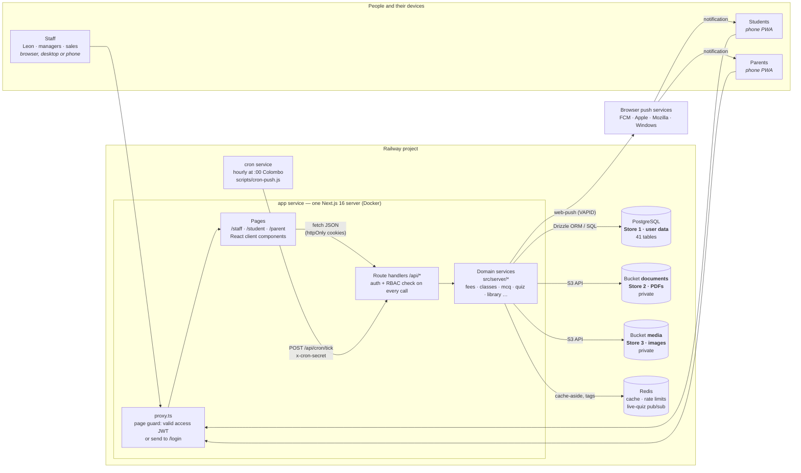
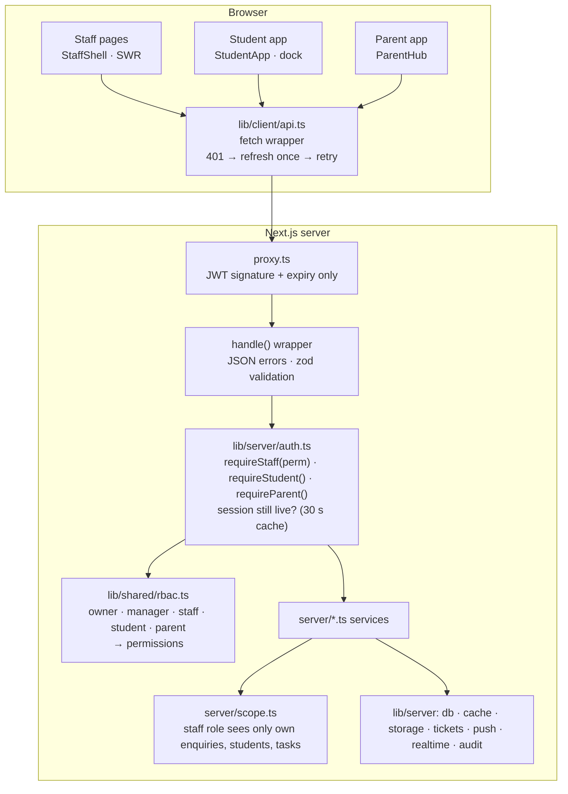
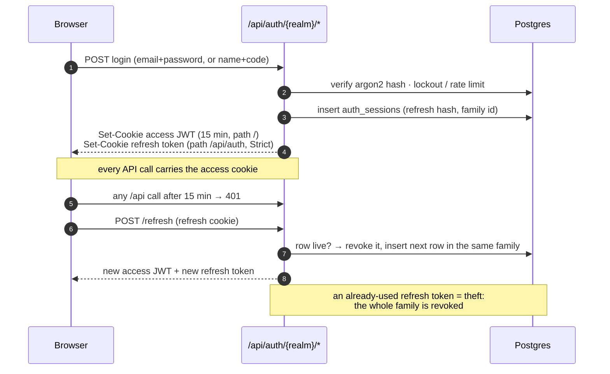
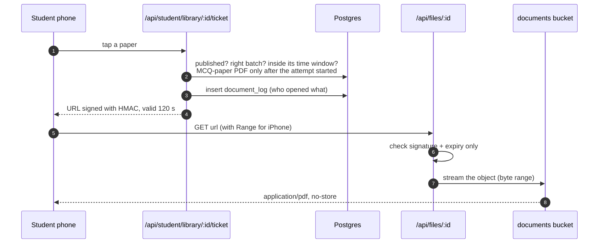
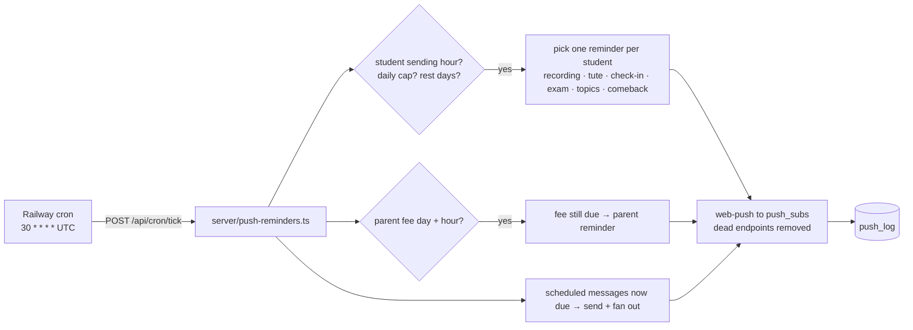
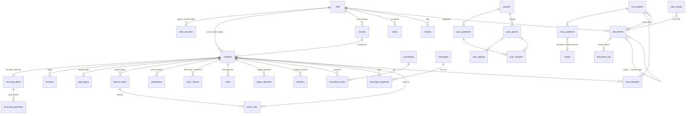

# Architecture

How BS With Leon fits together: the apps, the server, the three stores,
and the database tables. The diagrams are [Mermaid](https://mermaid.js.org/)
and render on GitHub and in VS Code's Markdown preview.

---

## 1 · The whole system



**Why three stores.** Postgres holds everything about people and money,
plus the *index* of every file (title, year, who may see it, storage key).
The bytes live in two private S3-compatible buckets: one for PDFs, one for
images. Nothing is ever linked straight to a bucket; the app checks who is
asking, then streams the file.

**Redis is disposable.** It holds cached reads, sign-in rate counters and
the live-quiz fan-out. Wiping it loses nothing. Without `REDIS_URL` the app
falls back to an in-process cache.

**Locally** the same shape runs from `docker-compose.yml`: Postgres :5433,
Redis :6380, MinIO :9000 (both buckets). With no Docker, the two buckets
fall back to two folders under `.storage/`.

---

## 2 · Inside the app server



Every API route starts with one line that names the permission it needs:

```ts
export const POST = handle(async (req) => {
  const p = await requireStaff('fees.manage'); // 401 if signed out, 403 if not allowed
  ...
});
```

| Role | Sees |
|---|---|
| **owner** | everything, including Team (add users, roles) and Settings |
| **manager** | everything except Settings and adding users |
| **staff** (Sales) | Dashboard, Enquiries, Students, Task Book: only their own rows |
| **student** | their own data in the student app; never payments, never answer keys |
| **parent** | their own child's fees, attendance and class progress, nothing else |

---

## 3 · Signing in and staying signed in



* Staff: email + password (argon2id). 5 wrong passwords pause the account 15 min.
* Students and parents: name + a 6-digit code staff issue, valid 24 h,
  stored only as a hash. 5 wrong codes lock the login.
* Each realm has its own cookie pair, so a staff and a student session can
  share one browser.

---

## 4 · Opening a past paper (the document ticket)



A link copied into WhatsApp stops working two minutes later. Images
(`/api/media/:id`) need any signed-in session and are cached by the browser
for a year, because a media row never changes.

---

## 5 · Timed MCQ papers and the live quiz

* **Rule zero:** an answer key never reaches a phone early.
  `server/mcq.ts` hands out questions without `answer`/`why`, starts the
  clock **on the server**, and returns the answers once, in the reply to
  submit. `server/quiz.ts` reveals the answer only in the `reveal` state.
* **Live quiz realtime:** the host and every phone poll the state every 2 s
  and also listen on a Server-Sent Events stream (`/api/quiz/:game/events`)
  for an instant nudge. With several app instances the nudge fans out
  through Redis pub/sub.

---

## 6 · Reminders (cron → web push)



---

## 7 · The database

41 tables in one Postgres database (`src/db/schema.ts`, migrations in
`drizzle/`). Grouped by purpose:



| Group | Tables |
|---|---|
| **Identity & security** | `staff`, `auth_sessions`, `app_logins`, `parent_logins`, `login_audit`, `activity` |
| **Students & money** | `students`, `recurring_plans`, `recurring_payments`, `invoices`, `records` (enquiries), `tasks`, `products` |
| **Class** | `attendance`, `class_log`, `tute_assign`, `tutes`, `recordings`, `recording_views`, `topic_checks`, `checkins`, `paper_attempts` |
| **Messages & push** | `messages`, `message_recipients`, `push_subs`, `push_log` |
| **Practice** | `mcq_papers`, `mcq_questions`, `mcq_attempts`, `essay_templates`, `quizzes`, `quiz_questions`, `quiz_games`, `quiz_players`, `quiz_answers` |
| **Syllabus & config** | `unit_weights`, `chapters`, `app_config` (one row: student-app config + Customize overrides) |
| **File index** | `documents` + `document_log` (→ bucket *documents*), `media` (→ bucket *media*) |

---

## 8 · Code map

```
src/
  proxy.ts                 page guard (Next 16's middleware)
  db/schema.ts             every table
  lib/shared/              rbac · constants (CFG, prices, syllabus) · dates (Asia/Colombo)
  lib/server/              db · auth · tokens · password · api · cache · storage
                           tickets · push · realtime · ratelimit · audit · env
  lib/client/api.ts        browser fetch wrapper (auto refresh)
  server/                  domain services, one file per area
  app/api/                 route handlers: auth · staff · student · parent · files · media · quiz · cron · health
  app/staff|student|parent each app's layout, login and pages
  components/staff|student|parent  UI; original CSS in src/styles/*.css
scripts/                   migrate · seed · cron-push (bundled to scripts/dist for the image)
drizzle/                   SQL migrations, applied on every deploy
tests/                     node:test suites against a real Postgres
```
